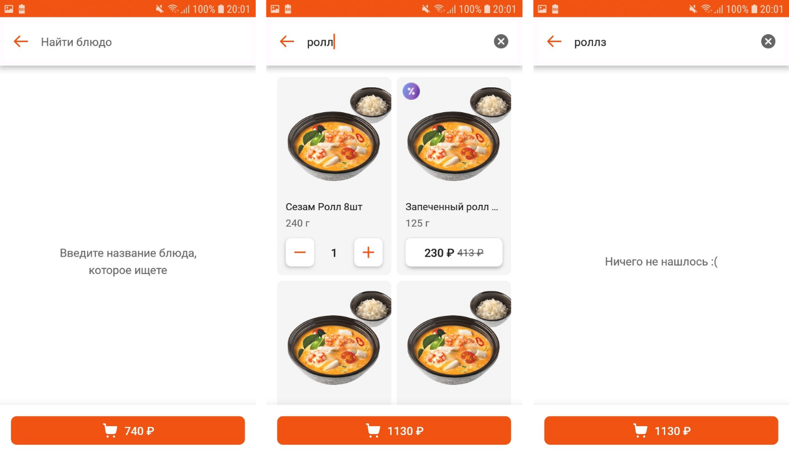

# FOODIES - Тестовое задание

## Краткое описание

Данное мобильное приложение представляет собой приложение для заказа еды. Оно предоставляет следующие возможности: просмотр каталога, просмотр информации о товаре, добавление товара в корзину, редактирование количества товара в корзине (также, удаление товара из корзины), отображение общего счетчика суммы товаров в корзине и просмотр товаров в корзине. Реализованы также дополнительные функции филтрации товаров по тэгам и поиск по названию. Также добавлена анимация на экране загрузки приложения (Splash Screen).

## Добавленные фичи
- Тэги
  Во входных данных мы имеем 5 тэгов, которые могут отображаться в карточке товаров, а также они используются при фильтрации товаров. Т.к. в предоженном макете есть изображения только для 3 тэгов (один из которых определятеся не по индексу, а по наличию скидки), мною было принято решение добавить изображения для остальных тэгов. Для того, чтобы отображать их в карточке товара был создан data class, где полями класса выступают id тэга, его название и само изображение. В companion object хранится лист этих тэгов, и после того, как с помощью API был получен список тэгов, вызывается метод, который заполняет этот лист, "ассоциируя" название с изображением. После чего, для отображения тэгов взаимодействие происходит с заполненным листом.

- Анимации
  В приложение, для лучшего восприятия, добавлены анимации. Например, когда корзина заполняется, кнопка для перехода на страницу корзины плавно "вырастает" из нижней части экрана. Когда корзина становится пустой, кнопка также "исчезает" с экрана. Также имеются анимации загрузки экранов, анимация удаления товара из списка в корзине, анимация модального окна для выбора фильтров, анимация навигации между экранами и анимация начального экрана - Splash Screen'а.

***
## Примеры
#### Каталог

На данном экране можно просматривать список товаров по разным категориям, переходить к подробной информации о товаре, добавлять товары в корзину и изменять их количество. Предусмотрен вариант отсутствия товаров в выбранной категории - на экране отображается соответвующее сообщение.

#### Карточка товара

На данном экране можно узнать подробное описание товара и его состав. Здесь также есть возможность добавления товара в корзину и изменение его количества в корзине.

#### Корзина

На данном экране отображаются все товары, добавленные в корзину. Здесь можно изменять количество добавленного товара. Также предусмотрен вариант отстутсвия товаров в корзине - на экране отображается соответвующее сообщение.

### Дополнительные функции
В top bar'е имеются две кнопки: слева - для выбора фильтров, которым должны соответвовать отображаемые товары, справа - для поиска нужных товаров.

#### Фильтрация товаров
В открывающемся окне есть возможность выбора тех фильтров, по которым должен осуществляться поиск товаров. Для каждой категории есть возможность просмотра товаров с установленными фильтрами. Если товаров с такими фильтрами не найдено - отображается соответствующее сообщение.

#### Поиск товаров
На данном экране расположен search bar, для поиска товаров. Поиск осущетвлется по названию товаров. Есть возможность удалить введенный текст полностью. Если товаров с таким названием не найдено - отображается соответвующее сообщение.

#### Анимация Splash Screen
Анимаиция реализована с помощью Lottie Animation.

